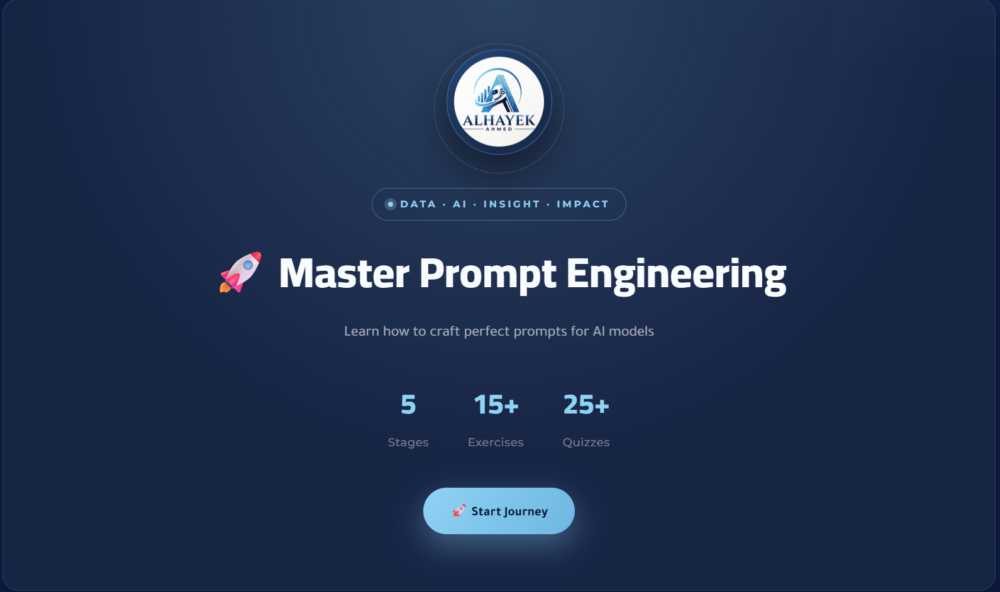

<div align="center">

# 🎯 Prompt Engineering Mastery

### دليل تعليمي تفاعلي شامل لهندسة المطالبات (Prompt Engineering)

موقع ويب تعليمي من تصميم وإعداد **أحمد وسام الحايك**، مبني على أساس دراسة ذاتية وورش عمل ودورات تدريبية من مصادر معتمدة.

[](https://github.com/Alhayek7/Prompt-Engineering/blob/main/LICENSE)
[](#)
[](#)
[](https://github.com/Alhayek7/Prompt-Engineering/pulls)
[](https://github.com/Alhayek7/Prompt-Engineering/stargazers)

**[🌐 عرض الموقع مباشرة](https://alhayek7.github.io/Prompt-Engineering/)** &nbsp;•&nbsp; **[📖 المحتوى](#-محتويات-الدليل)** &nbsp;•&nbsp; **[🤝 المساهمة](#-كيفية-المساهمة)** &nbsp;•&nbsp; **[📞 التواصل](#-التواصل-والدعم)**

</div>

<br>

<div align="center">



<sub>*ضع هنا لقطة شاشة حقيقية من الموقع — راجع قسم "إضافة الصور" أسفل الملف*</sub>

</div>

---

## 📋 جدول المحتويات

- [نظرة عامة](#-نظرة-عامة)
- [الأهداف التعليمية](#-الأهداف-التعليمية)
- [محتويات الدليل](#-محتويات-الدليل)
- [كيفية عرض الموقع](#-كيفية-عرض-الموقع)
- [هيكلية المستودع](#-هيكلية-المستودع)
- [كيفية المساهمة](#-كيفية-المساهمة)
- [المراجع والمصادر](#-المراجع-والمصادر)
- [التواصل والدعم](#-التواصل-والدعم)
- [الترخيص](#-الترخيص)

---

## 📖 نظرة عامة

**Prompt Engineering Mastery** هو موقع ويب تعليمي تفاعلي (صفحة واحدة) يشرح مفاهيم هندسة المطالبات بأسلوب عربي مبسّط ومنظم، موجّه لكل من يريد إتقان التعامل مع نماذج اللغة الكبيرة (LLMs) مثل ChatGPT وClaude وGemini وغيرها.

> 💡 لا حاجة لأي خبرة برمجية مسبقة — الموقع مصمَّم ليكون مرجعًا عمليًا لأي شخص، من المبتدئ إلى المطوّر المحترف.

<table>
<tr>
<td width="33%" align="center">

### 🧠
**محتوى مبسّط**
شرح المفاهيم المعقّدة بلغة عربية واضحة ومباشرة

</td>
<td width="33%" align="center">

### 🛠️
**أمثلة تطبيقية**
نماذج مطالبات جاهزة يمكن تجربتها فورًا

</td>
<td width="33%" align="center">

### 📚
**مصادر موثوقة**
مبني على دراسة معمّقة ومصادر معتمدة عالميًا

</td>
</tr>
</table>

---

## 🎯 الأهداف التعليمية

| # | الهدف | الوصف |
|---|-------|-------|
| 1 | **Zero-shot & Few-shot Prompting** | تعلم كيفية توجيه النموذج بدون أمثلة أو باستخدام أمثلة قليلة |
| 2 | **Chain-of-Thought (CoT)** | فهم استراتيجيات التفكير التسلسلي لتحسين دقة الإجابات |
| 3 | **Self-Consistency & Tree of Thoughts** | التعرف على منهجيات متقدمة لتوليد إجابات أكثر موثوقية |
| 4 | **مطالبات متخصصة** | تصميم Prompts للتلخيص، الترجمة، التحليل، والبرمجة |
| 5 | **تجنب الأخطاء الشائعة** | التعرف على الأخطاء المتكررة عند كتابة المطالبات وكيفية تفاديها |

---

## 📚 محتويات الدليل

<details>
<summary><strong>اضغط لعرض الأقسام الرئيسية للموقع</strong></summary>

<br>

- **المقدمة**: ما هي هندسة المطالبات ولماذا هي مهمة؟
- **الأساسيات**: مكوّنات المطالبة الجيدة (السياق، التعليمات، الأمثلة، الصيغة)
- **التقنيات المتقدمة**: Chain-of-Thought، Self-Consistency، Tree of Thoughts
- **حالات استخدام عملية**: تلخيص، ترجمة، تحليل بيانات، توليد أكواد
- **أفضل الممارسات**: نصائح لكتابة مطالبات فعّالة ومتينة
- **مصادر إضافية**: روابط لأوراق بحثية وأدلة متخصصة

</details>

---

## 🌐 كيفية عرض الموقع

المشروع **ثابت بالكامل (Static)** — مبني بـ HTML/CSS/JS في ملف واحد، بدون أي تبعيات أو تثبيت.

### الطريقة الأولى — عرض مباشر عبر GitHub Pages (موصى بها)

```
https://alhayek7.github.io/Prompt-Engineering/
```

> ⚠️ يتطلب تفعيل GitHub Pages من: **Settings → Pages → Branch: main**

### الطريقة الثانية — تشغيل محلي

```bash
# 1. استنساخ المستودع
git clone https://github.com/Alhayek7/Prompt-Engineering.git
cd Prompt-Engineering

# 2. تشغيل خادم محلي بسيط
python3 -m http.server 8000
```

ثم افتح المتصفح على: `http://localhost:8000`

أو ببساطة، افتح ملف `index.html` مباشرة بالنقر المزدوج عليه.

---

## 📂 هيكلية المستودع

```
Prompt-Engineering/
│
├── 📄 index.html      # الموقع التعليمي بالكامل (المحتوى + التصميم + التفاعلية)
├── 📄 README.md        # هذا الملف
├── 📄 LICENSE           # رخصة MIT
└── 📄 .gitignore
```

---

## 🤝 كيفية المساهمة

المساهمات مرحّب بها دائمًا لتطوير المحتوى أو تحسين التصميم 🙌

```bash
# 1. اعمل Fork للمستودع

# 2. أنشئ فرعًا جديدًا لميزتك
git checkout -b feature/AmazingFeature

# 3. احفظ تغييراتك
git commit -m 'Add: شرح تقنية جديدة'

# 4. ارفع الفرع
git push origin feature/AmazingFeature

# 5. افتح Pull Request
```

### ✅ قواعد المساهمة

- حافظ على وضوح الشرح وسهولة القراءة باللغة العربية
- التزم بنفس أسلوب التصميم المستخدم في الموقع
- تأكد من أن أي مثال أو مطالبة (Prompt) صحيح ومجرَّب فعليًا قبل إضافته
- افتح Issue أولًا لمناقشة أي تغيير جوهري قبل البدء بالعمل عليه

---

## 📚 المراجع والمصادر

- [دليل OpenAI لهندسة المطالبات](https://platform.openai.com/docs/guides/prompt-engineering)
- [ورقة Chain-of-Thought Prompting](https://arxiv.org/abs/2201.11903)
- [دليل LangChain للمطالبات](https://python.langchain.com/docs/modules/model_io/prompts/)
- [Prompt Engineering Guide](https://www.promptingguide.ai/)
- [Hugging Face Course](https://huggingface.co/learn/nlp-course)

---

## 📞 التواصل والدعم

<div align="center">

| | |
|---|---|
| 👨‍💻 **المطور** | أحمد وسام الحايك |
| 📧 **البريد الإلكتروني** | [aalhayek7@smail.ucas.edu.ps](mailto:aalhayek7@smail.ucas.edu.ps) |
| 🔗 **رابط المشروع** | [github.com/Alhayek7/Prompt-Engineering](https://github.com/Alhayek7/Prompt-Engineering) |

</div>

---

## 📜 الترخيص

هذا المشروع مرخّص تحت رخصة **MIT** — راجع ملف [LICENSE](https://github.com/Alhayek7/Prompt-Engineering/blob/main/LICENSE) للتفاصيل الكاملة.

```
حقوق النشر © 2026 أحمد وسام الحايك

يُسمح بإعادة الاستخدام والتعديل والتوزيع بحرية،
شريطة ذكر المصدر الأصلي والإشارة إلى هذا الترخيص.
```

---

<div align="center">

### ⭐ إذا أعجبك المشروع، لا تنسَ منحه نجمة!

صُنع بـ ❤️ في فلسطين 🇵🇸

</div>
